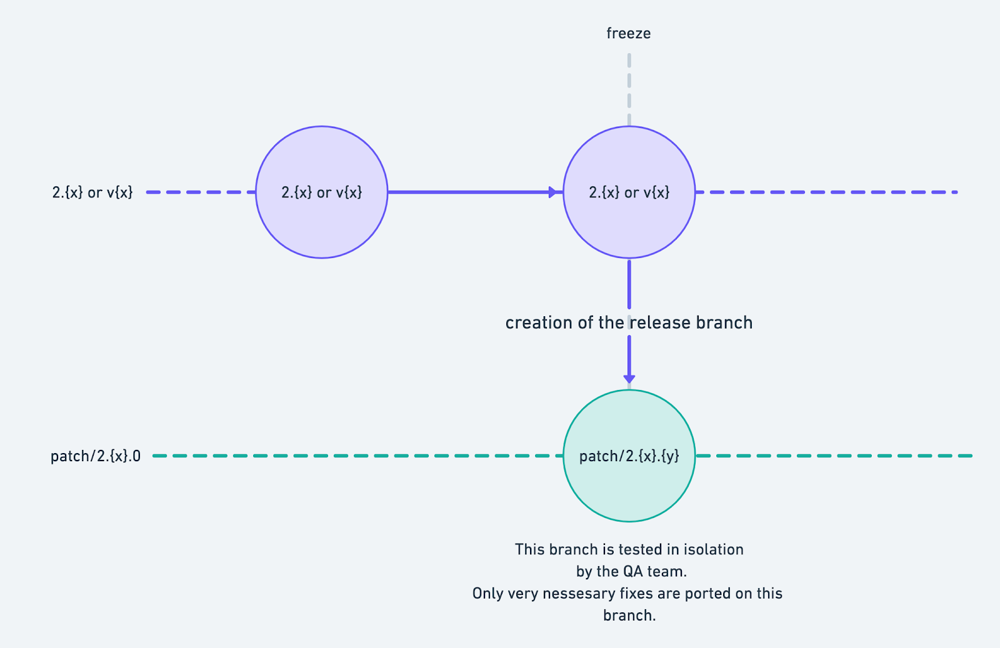

# DHIS2 release lifecycles

This is a walk through on the DHIS2  software releases and its lifecycles. Starting off we are going to communicate some basic concepts in order to build a common language that we will use to better explain the release cycle.


#### Backend core application 

The first one is the backend service. The DHIS2 organisation has a single backend service which serves all the different frontend and mobile applications. Among other responsibilities the backend is also responsible for building the backend services and frontend core applications. The output of the build is a `war` file which the end users can download from our [download page](https://www.dhis2.org/downloads). 

To communicate releases the [repository of the backend application](https://github.com/dhis2/dhis2-core) follows a branching naming convention. According to this convention the `master` branch includes the latest of the implemented software and is always the next candidate for a major release. For each major released version of the DHIS2 software there is a branch that follows the` 2.{x}` pattern. Eg. `2.35`. 


#### Frontend core applications

DHIS2 implements and maintains different core web applications.  The core web apps also follow a branching convention, however that is slightly different from the one followed in the backend. Same as in the backend the `master` branch includes the latest of the implemented software and is always the next candidate for a major release. However for each released version of the software there is a branch that follows the `v{x}` pattern. Eg. `v35`.  

_Note: There are some core frontend apps that are currently not following this convention. While writing this the exceptions are the [data-visualiser-app](https://github.com/dhis2/data-visualizer-app/) which is using a different convention and [a list of apps](https://github.com/dhis2/dhis2-core/tree/master/dhis-2/dhis-web/dhis-web-apps) where feature toggling is being used._


#### Supported versions

DHIS2 supports the _last three releases_. This includes the most recent release. Any bugs found are tested against the supported versions and `master`. The fixes are back-ported on the last three releases when applicable. New features are implemented only on `master` and are rarely back-ported.


## Major releases

A new major release is taking place every six months and includes all the development that has happened on the `master` branch those months. To create a major release we always branch off from `master`, what is at that moment on `master` becomes the latest major version of the DHIS2 software. 


### A major release lifecycle

_To better communicate the major release lifecycle we will imagine that we are preparing for the major release `2.35`._


#### Phase one - soft freeze

Several weeks before the planned release - usually five - we announce what we call a _soft freeze_. This is the point where the branches `2.35`  and `v35` are created. _From that point onwards, pushing to <code>master</code> means implementing changes for <code>2.36</code>_.


#### Phase two - hard freeze

Two weeks later, a `hard freeze` is announced. At this point the first patch of the major release starts taking place. A branch named `patch/2.35.0` is generated on all the repos that will be included in the release. The `patch/2.35.0` is created from the `HEAD`  of the `2.35`  and `v35`. These branches include the code that will go in the release. Having patch branches gives space to the QA team to test in isolation the code that will go public. Only in _necessary_ cases fixes are ported on the patch branches. 

When the testing is done a release takes place and a new `war` is being created. These are stable releases and are the ones we announce to the public and we recommend for use in production. They also are the main ones we upload on our [downloads page](https://www.dhis2.org/downloads). 

_A visual representation of the major release cycle._


## Patch releases

Patches are being released approximately every 9 weeks. Unlike a major release, patch releases do not happen from `master`.  On <code>[dhis2-core](https://github.com/dhis2/dhis2-core)</code> we branch off from the <code>2.{x}</code> and on the web apps we branch off from the <code>v{x}</code> branches. 


### A patch release lifecycle

_To better communicate the patch release lifecycle we will imagine that we are preparing for the patch release <code>2.35.1</code>._

A patch release scenario is simpler than a major release therefore there is no soft and hard freeze only _freeze_. Freeze is the same as a hard freeze on a major release. When it is announced branches named `patch/2.35.1` are generated on all the repos that will be included in the release. The base of the branches  `patch/2.35.1` is the `HEAD` of `2.{x}` or `v{x}`. _From this point onwards, pushing to  <code>2.35</code> or <code>v35</code> means implementing changes for the next patch release eg. <code>2.35.2</code>._

Same as before the  <code>patch/2.35.1</code> branches include the code that will go in the <code>2.35.1</code> release. Patch branches are tested by the QA team and in <em>rare</em> cases code is ported on those.

When the testing is done a release takes place and a new <code>war</code> is being created. These are stable releases and are the ones we announce to the public and we recommend for use in production. They also are the main ones we upload on our [downloads page](https://www.dhis2.org/downloads). 

_A visual representation of a patch release cycle._



## Building the `war` file

DHIS2 maintains a separate GitHub organisation, called <code>[d2-ci](https://github.com/d2-ci/)</code>. Every existing core web app repository in the <code>[dhis2](https://github.com/dhis2)</code> GitHub organisation has a repository with the same name in the <code>d2-ci </code>organisation. Eg. [d2-ci/gis-app](https://github.com/d2-ci/gis-app) and [dhis2/gis-app](https://github.com/dhis2/gis-app). In other words, the <code>d2-ci</code> organisation serves the purpose of storing the optimised production ready artifacts of each application that builds successfully. Building and pushing into the <code>d2-ci</code> repo takes place during the CI/CD of each application when either a tag or a commit is pushed. 

To complete the picture there is one more key concept we need to explain. In the <code>[dhis2-core](https://github.com/dhis2/dhis2-core)</code> there is a JSON file called <code>[apps-to-bundle.json](https://github.com/dhis2/dhis2-core/blob/master/dhis-2/dhis-web/dhis-web-apps/apps-to-bundle.json). </code>As the name suggests, there we capture all the apps the <code>war</code> file will include . There you are also given the option to choose the exact version of the bundle for each app. You do that by specifying either a branch, a tag, or a commit hash. The <code>dhis2-core</code> will then fetch the artifacts from the <code>d2-ci </code>repo during the build time and stitch it together to create the <code>war</code> file. An example of the JSON file with only 4 apps would look like the code below. The example is written in pseudo-JSON. 


```javascript
[
// it will fetch the latest build from the master branch
"https://github.com/d2-ci/event-charts-app",
// it will fetch the latest build from the v32 branch
"https://github.com/d2-ci/import-export-app#v32",
// it will fetch the specific commit 
"https://github.com/d2-ci/gis-app#5afaf70e8b7e427bc064fa025610eea2c0e195e5",
// it will fetch the build from the tag
"https://github.com/d2-ci/maintenance-app#2.31.1",
]
```


 
A detailed explanation on the different modules responsible for the release and its underlying mechanisms is described in this [article](https://dhis2.github.io/2019/02/the-build-system/). If you interested in looking into some more practical tips on how to build the dhis2 system then you can read more about it [here](https://dhis2.github.io/2019/03/build-acrobatics/).  
