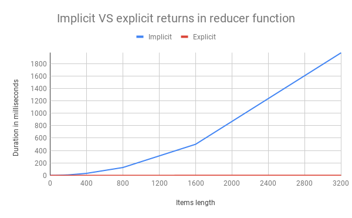

# Implicit vs exlicit returns in reducer functions

## Context
As explained in [this discussion](https://github.com/dhis2/notes/issues/39), a reduce function with an implicit return is **VERY SLOW**, because of the object spread operator/ `Object.assign`, which is used in every iteration. So when you have more than 100-200 items to iterate over, please make sure to use direct assignment instead.

**Slow**
```javascript
arr.reduce(
    (acc, { id, value }) => ({
        ...acc,
        [id]: value,
    }),
    {}
)
```

**Fast**
```javascript
arr.reduce(
    (acc, { id, value }) => {
        acc[id]: value
        return acc
    },
    {}
)
```
## Differences visualized


The differences become more pronounced once the items length increases. At length 400 there is a significant divergence between the two approaches. Hence the advice to only use the slower variant up to 100-200 items.


## Fast and implicit
By using a small utility function you could keep doing implicit returns _without the performance impact_.
```javascript
const setProperty(obj, key, value) => {
  obj[key] = value
  return obj
}
list.reduce((out, item) => setProperty(out, item.key, item.value), {})
```

Or alternatively, something like this:
```javascript
const reduceToObject = (list, extractor) => (
  list.reduce((accum, item) => {
    const [key, value] = extractor(item)
    accum[key] = value
    return accum
  }, {})
)

reduceToObject(list, ({ key, value }) => [key, value])
```
