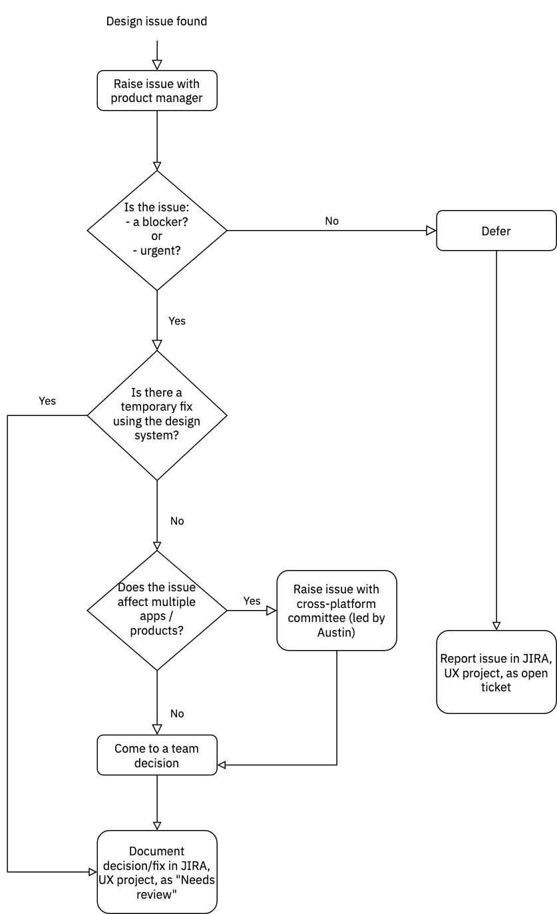

Date: 2022/02/15
Who: Austin, Hendrik, Joe

# Agenda

-   Establish process for handling design tasks while Joe is on parental leave.

## Minutes

- Joe is taking parental leave from 2022/02/28 up to and including 2022/06/24.
- Marcos Campos will provide design support while Joe is away, but there will not be a full time cover.
- No new design work will start or take place while Joe is away.
- Austin is familiar with the design work that is ready to implement (Maintenance app, new Platform features).
- Design issues that come up will be handled with a process, detailed below.
- Austin will lead a cross-product committee to discuss design issues that affect multiple product teams.

### Process: Design issues

Design issues should be handled using the following process:

## Links
- [UX project on JIRA](https://jira.dhis2.org/projects/UX/issues/)