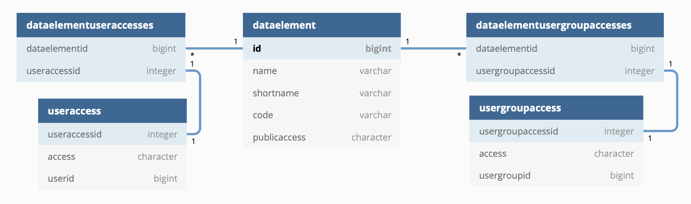

# Sharing model

## 1. Motivation
Current Sharing model has some disadvantages:
- Introduced too many tables in database. Each sharing object has two table `*.useraccesses` and `*.usergroupaccesses`. There are total 96 tables for storing sharing data in DHIS2 database.
- Querying objects with sharing enabled also required joining those two tables, which is slow.

- Below is the current sharing model diagram for `DataElement`
<p align="center">

</p>

## 2. Introducing new JSONB column
- To solve the issue, from `2.36` we are replacing the sharing tables with new `sharing` column. The column data type is `jsonb` type. It contains all the sharing data for an object in json format.
<p align="center">

</p>

- Below is the value format of `sharing` object.

```json
{
    "owner": "GOLswS44mh8",
    "external": false,
    "public": "rwrw----",
    "users": {
        "xE7jOejl9FI": {
            "access": "rw------",
            "id": "xE7jOejl9FI"
        }
    },
    "userGroups": {
        "tH0GcNZZ1vW": {
            "access": "rwrw----",
            "id": "tH0GcNZZ1vW"
        },
        "Rg8wusV7QYi": {
            "access": "rw------",
            "id": "Rg8wusV7QYi"
        }
    }
}
    
```
## 3. Introducing  `owner` property
- We introduced a new `owner` property inside `sharing`. This contains UID of the `User` who owns the object. 
- ACL service will check sharing access using this `owner` property.
- Object's owner can be changed/transfered to other `User`. The design of the feature still need to be discussed.
- Currently on saving, the `onwer`property's value is copied from the `user` for backward compatibility. But this will be changed after we decided on the features design of this property.
- Current `user` property's name will be changed to `createdBy`. This property is  immutable. It means once the object is created, you can change the `owner` but not `createdBy`.

## 4. Migration
Added Flyway script
- Copy all current sharing data to new jsonb column.
- Delete all legacy tables.

## 5. Effects on current `/sharing` api
- This change doesn't modify the behavior of current `/api/sharing` endpoint. It will work the same as before, consuming same payload format and producing same response.
- In the backend, all incomming sharing data will be converted to the new format and save to new `sharing` jsonb columns.

## 6. New `/sharing` Endpoint
- For saving `sharing` with new format, send PUT request to `/api/<object>/{uid}/sharing` endpoint.

` PUT /api/categoryOptions/FbLZS3ueWbQ/sharing`

```json
{
    "owner": "GOLswS44mh8",
    "external": true,
    "users": {
        "xE7jOejl9FI": {
            "access": "rw------",
            "id": "xE7jOejl9FI"
        }
    },
    "userGroups": {
        "tH0GcNZZ1vW": {
            "access": "rwrw----",
            "id": "tH0GcNZZ1vW"
        },
        "Rg8wusV7QYi": {
            "access": "rw------",
            "id": "Rg8wusV7QYi"
        }
    },
    "public": "rw------"
}
```


